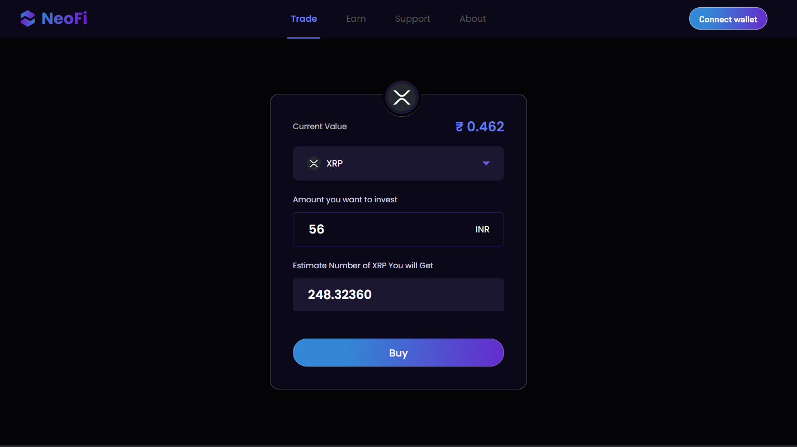
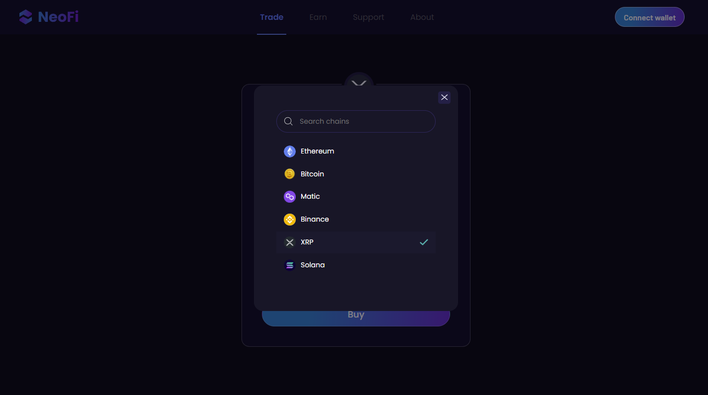
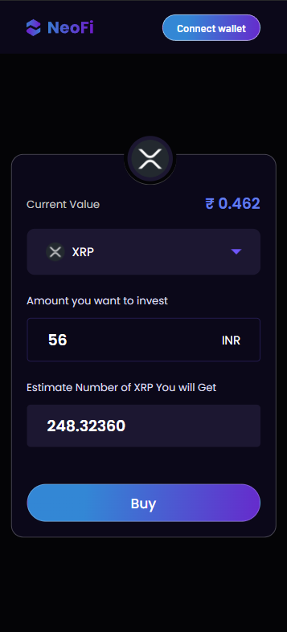
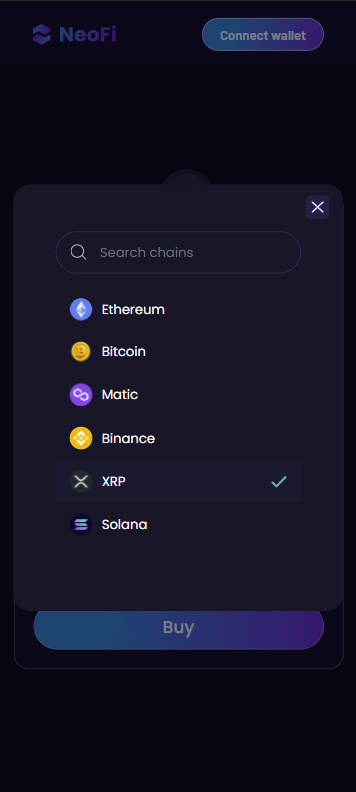

# Neofi

## Table of Contents

-   [Overview](#overview)
    -   [Screenshot](#screenshot)
    -   [Demo](#demo)
    -   [Features](#features)
    -   [Technologies Used](#technologies-used)
-   [Getting Started](#getting-started)
    -   [Installation](#installation)
    -   [Running the App](#running-the-app)

## Overview

### Screenshot

### Demo

Check out a live demo of the app [here](https://neofi-eight.vercel.app/).

### Features

Users can:

-   Check the real time price of coin
-   Change the coin type through modal
-   Check the quantity of coin they can buy buy inputting the price

### Technologies Used

-   [Vite](https://vitejs.dev/) for build and development tooling
-   [React](https://reactjs.org/)
-   [Sass](https://sass-lang.com/) for styling
-   [Zustand](https://github.com/pmndrs/zustand) for state management
-   [Vercel](https://www.vercel.com/) for deployment

## Getting Started

### Installation

To install the project, run:

`npm install` or `yarn add`

### Running the App

To run the app, run:

`npm run dev` or `yarn run dev`

This will start the development server at `http://localhost:3000`.
